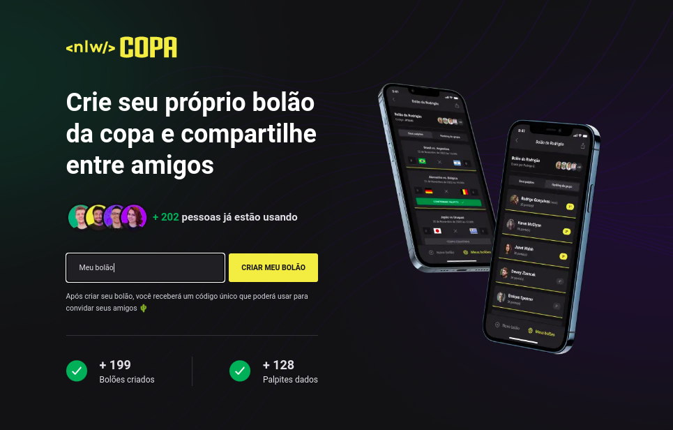

<div align="center">

  
  <p>
    Rocketseat · Ignite Trail
  </p>

</div>

## 💡 Project

It's a betting app for football matches on the championship of the world cup.
[Files](https://efficient-sloth-d85.notion.site/NLW-10-Copa-235da64b014048b4a4c25229b67ecb12) and [Figma](<https://www.figma.com/file/ZvzOjOvbCinBTrEo9jN6ND/Bol%C3%A3o-da-Copa-(Community)?t=G7vVwdfntvLlobe4-0>).

## 🎯 Goals

Develop a project that applied the fundamental concepts of React, React Native, NodeJS and fulfilled the following requirements:

- [x] Develop with TypeScript
- [x] Integrate projects: Server, Mobile and Web
- [x] Follow the design [Figma](<https://www.figma.com/proto/FWRSplMx3BaVsQCHNWR9rH/NLW-eSports-(Community)?node-id=0%3A1>)
- [x] Authentication with OAuth2 Google and JWT

## 🥳 Application

### Web

<p align="left">
  
</p>

## 🦸‍♂️ Support techs

### Server

- [Prisma](https://www.prisma.io/) (ORM)
- [Fastify](https://www.fastify.io/) (Web framework)
- [Cors](https://www.npmjs.com/package/cors) (Cross-origin resource sharing)
- [SQLite](https://www.sqlite.org/index.html) (Database)

### Web

- [NextJS](https://nextjs.org/) (React framework)
- [Phosphor](https://phosphoricons.com/) (Icons)
- [Radix UI](https://www.radix-ui.com/) (UI components)

### Mobile

- [Expo](https://expo.io/) (React Native framework)

## 💻 Made with

[](https://developer.mozilla.org/pt-BR/docs/Web/JavaScript)
[](https://www.typescriptlang.org/)
[](https://pt-br.reactjs.org/)
[](https://pt-br.reactjs.org/)
[](https://developer.mozilla.org/pt-BR/docs/Web/HTML)
[](https://developer.mozilla.org/pt-BR/docs/Web/CSS)

## 🛠️ Tools

[](https://code.visualstudio.com/)
[](https://pop.system76.com/)
[](https://pop.system76.com/)

## 🚀 How to run

Clone o projeto

```bash
  git clone https://github.com/laripeanuts/rs-nwl-copa.git
```

Vá para a raiz do diretório

### Server

```bash
  cd /server
```

Instale as dependências

```bash
  pnpm install
```

Inicie o servidor local

```bash
  pnpm start
```

### Web

```bash
  cd /web
```

Instale as dependências

```bash
  pnpm install
```

Inicie localmente

```bash
  pnpm run dev
```

### Mobile

Required to generate a AUTH2 credentials in [Google Console](https://console.cloud.google.com/apis/credentials) for the Expo application. Read more about in [docs](https://docs.expo.dev/guides/authentication/#google).

warning Do not commit secret environments on .env files. It's recommended to save these variables in .env.local or .env.development.local files.

```env
API_URL=YOUR_API_URL
GOOGLE_CLIENT_ID=YOUR_API_KEY
```

```bash
  cd /mobile
```

Instale as dependências

```bash
  yarn install
```

Inicie localmente

```bash
  expo start
```

<p align="center">Copyright © 2022 ☕<a href="https://github.com/laripeanuts">laripeanuts</a></p> -->
